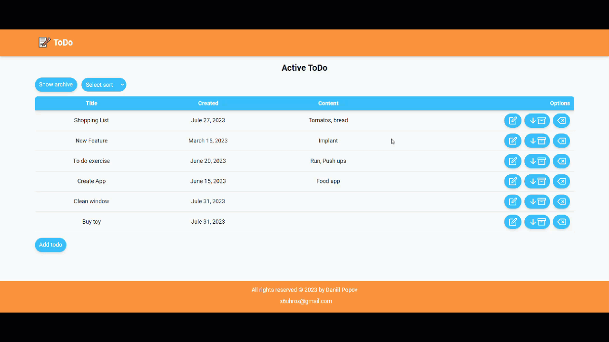

## App view



## Description of the project

The "To-Do" web app is a convenient tool for organizing tasks, ideas, and various random thoughts. This app helps users efficiently plan and manage their time, easing the organization of day-to-day tasks and projects.

## Implemented

1. One-page web app.
2. Create, edit, and remove tasks, ideas, in the to-do list.
3. Move or remove task, idea from/to archive.
4. Sort task, idea by title or by date.

## Technology stack:


## Project setup
```
npm install
```

### Compiles and hot-reloads for development
```
npm run start
```

### Compiles and minifies for production
```
npm run build
```

## Link to web app:

[Link to web app](https://test-task-to-do-vue-js.vercel.app/)

## Test task:

[Test task](https://docs.google.com/document/d/1TnLjxMGN1DgV6zUeT8KTiwBGZssgeuF2OaaqM9crgc4/edit?usp=sharing)


